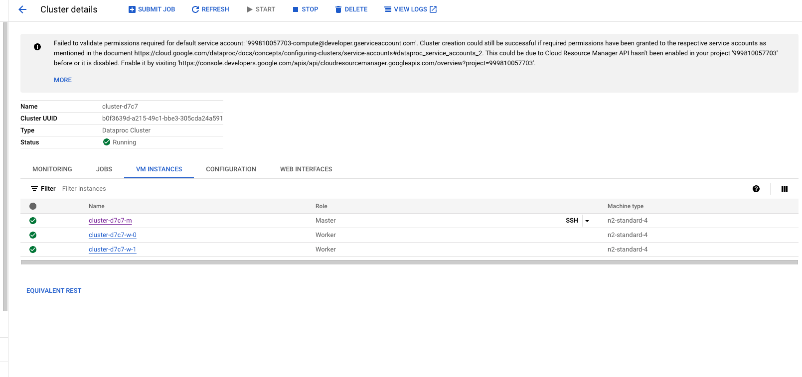
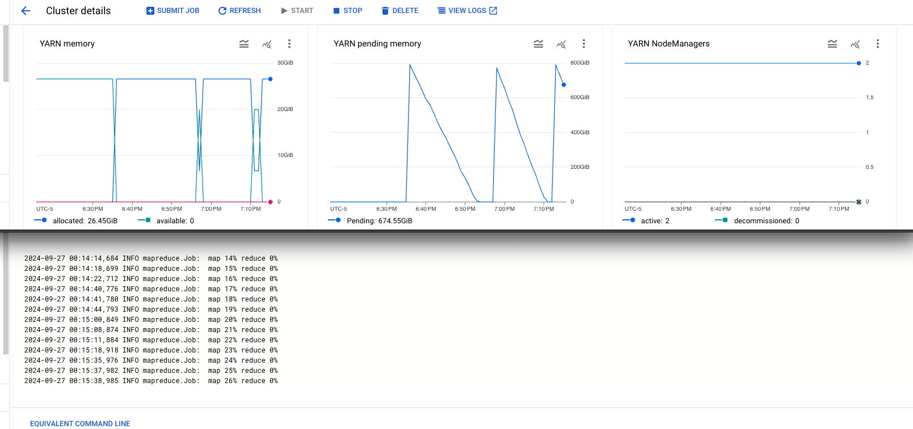
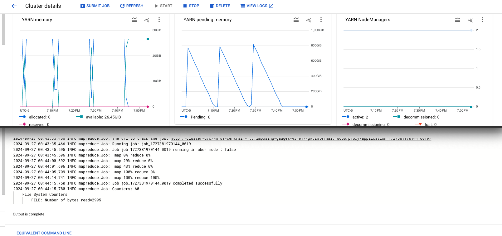
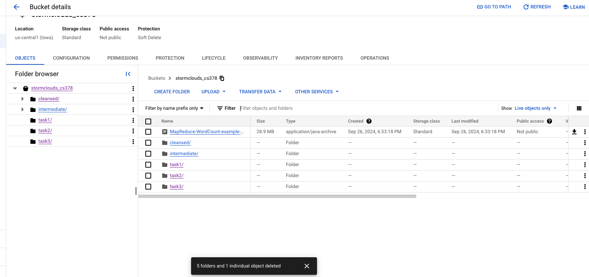

# Please add your team members' names here. 

## Team members' names 

1. Student Name: Ethan Chandra

   Student UT EID: ec42227

2. Student Name: Neha Kamble

   Student UT EID: nmk829

3. Student Name: Freddy Guo

   Student UT EID: fsg335

4. Student Name: Ojas Phirke

   Student UT EID: onp232

##  Course Name: CS378 - Cloud Computing 

##  Unique Number: 51515
    


# Add your Project REPORT HERE 

## Task 1 -  Errors in GPS Position Records

1	98845

2	74154

3	56387

4	43101

5	31690

6	27119

7	57746

8	98113

9	116525

10	119451

11	115709

12	120045

13	126326

14	126563

15	131907

16	128627

17	110253

18	132702

19	158397

20	162659

21	151530

22	150038

23	142818

24	124905

## Task 2 - Identifying the Five Taxis with the Highest GPS Error Rates

1. 0219EB9A4C74AAA118104359E5A5914C	1.0

2. AAC296CC8B17A8F92B23B8BF0312C4D9	1.0

3. 0D752625D41FAFA8CED8F259651E624C	1.0

4. 0EE3FFCBDFD8B2979E87F38369A28FD9	1.0

5. FE757A29F1129533CD6D4A0EC6034106	1.0

## Task 3 - Identifying the Ten Most Efficient Drivers in Terms of Earnings per Minute

1. FD2AE1C5F9F5FBE73A6D6D3D33270571	4094.9998

2. A7C9E60EEE31E4ADC387392D37CD06B8	1260.0

3. D8E90D724DBD98495C1F41D125ED029A	630.0

4. E9DA1D289A7E321CC179C51C0C526A73	231.29999

5. 95A921A9908727D4DC03B5D25A4B0F62	210.0

6. 74071A673307CA7459BCF75FBD024E09	209.99998

7. 42AB6BEE456B102C1CF8D9D8E71E845A	191.55

8. 28EAF0C54680C6998F0F2196F2DA2E21	179.99998

9. FA587EC2731AAB9F2952622E89088D4B	179.99998

10. E79402C516CEF1A6BB6F526A142597D4	144.54546

## Running on Dataproc Cluster









# Project Template

# Running on Laptop     ####

Prerequisite:

- Maven 3

- JDK 1.6 or higher

- (If working with eclipse) Eclipse with m2eclipse plugin installed


The java main class is:

edu.cs.utexas.HadoopEx.WordCount 

Input file:  Book-Tiny.txt  

Specify your own Output directory like 

# Running:


## Create a JAR Using Maven 

To compile the project and create a single jar file with all dependencies: 
	
```	mvn clean package ```


## Run your application
Inside your shell with Hadoop

Running as Java Application:

```java -jar target/MapReduce-WordCount-example-0.1-SNAPSHOT-jar-with-dependencies.jar SOME-Text-Fiel.txt  output``` 

Or has hadoop application

```hadoop jar your-hadoop-application.jar edu.cs.utexas.HadoopEx.WordCount arg0 arg1 ... ```


## Create a single JAR File from eclipse


Create a single gar file with eclipse 

*  File export -> export  -> export as binary ->  "Extract generated libraries into generated JAR"
